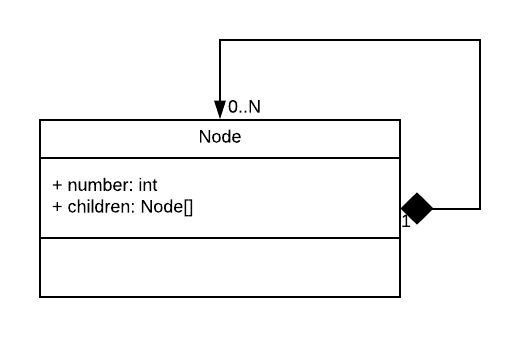

# Family Tree

El presente código contiene una representación de un árbol de números. Un árbol es una estructura que consiste de nodos conectados. Cada nodo contiene un dato (número) y una lista de nodos hijos, como muestra el siguiente diagrama:



Un nodo que no tiene hijos diremos que es una "hoja".

Además, el código contiene una implementación muy sencilla del patrón visitor. El visitador recorre el árbol y calcula la suma de todos los números.

Por ejemplo, dado un árbol:

```
    1
   / \
  2   3
```

el visitador dará como resultado el valor `6`: `1 + 2 + 3`.

## Parte 1: Abstracción del arbol

Como primer objetivo, deberán modificar el programa para poder representar un árbol familiar. Un árbol familiar es un árbol cuyos nodos contienen una persona. Para este caso, nos iteresa el nombre y la edad de cada persona.

Verán que la implementación del arbol provista es bastante rígida. Será tarea de ustedes modificar la implementación para hacerla más abstracta.

## Parte 2: Abstracción del visitador

Para esta segunda parte deberán trabajar en otra abstracción: la del visitador. La implementación del Visitor provista es también bastante rígida. En este caso, buscamos generar una abstracción de visitadores que puedan visitar árboles _genéricos_, por ejemplo, árboles cuyos nodos son números, o árboles cuyos nodos son Personas.

## Parte 3: ¿Abierto a la extensión?

Para esta última parte, deberás crear 2 nuevos visitadores:

1️⃣ El primero vistará un arbol familiar (de Personas), y calculará la edad total de todos los familiares.
2️⃣ El segundo vistará un arbol familiar (de Personas), y calculará encontrará al miembro de la familia con el nombre más largo.

